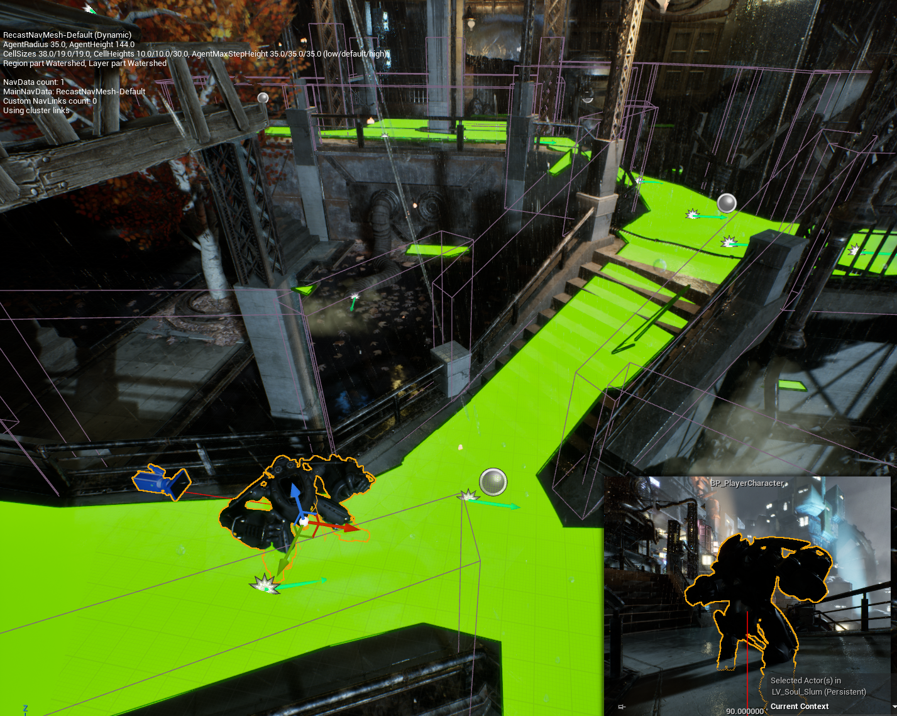

# 3D Melee Action Game



A 3D melee action game prototype developed with **Unreal Engine 5.6** and **Blueprint Visual Scripting**. The project focuses on building a complete melee gameplay loop, including player controls, camera switching, combo attacks, enemy AI, HUD, SFX, and VFX.

## Project Goals

This project was created to apply and demonstrate practical Unreal Engine development skills, including:

- Building gameplay systems with Blueprints.
- Designing animation-based melee combat.
- Connecting characters with AI Controllers and Behavior logic.
- Creating reusable gameplay logic with Blueprint Components.
- Implementing visual and audio feedback for player and enemy actions.
- Working with levels, animations, materials, particle effects, and audio assets.

## Implemented Features

### Player Controls

| Action | Input |
|---|---|
| Move | `WASD` |
| Look around | Mouse movement |
| Jump | `Space` |
| Sprint | `Shift` |
| Switch between first-person and third-person camera | `P` |
| Melee attack | Left mouse button |

One click performs a normal attack; repeated clicks trigger a combo sequence.

### Melee Combat System

- Blueprint-based attack system integrated with Animation Montages.
- Combo attacks triggered by consecutive player inputs.
- Hand or weapon hit tracing for melee collision detection.
- Reusable attack and health components.
- Animation, sound, and visual feedback for combat actions.

### Enemy AI

Enemy characters are built using Unreal Engine AI systems:

- `AI Controller` for enemy control.
- Behavior logic for managing enemy states.
- Player detection.
- Player pursuit after detection.
- Melee attacks when within range.
- Patrol behavior or returning to the original position when the player is no longer detected.

### HUD, SFX, and VFX

- HUD elements for gameplay-related character information.
- Sound effects for movement, footsteps, and attacks.
- Visual effects for player and enemy actions.
- Animation, materials, particle effects, and audio assets used to improve gameplay feedback.

## Main Blueprint Architecture

| Blueprint / System | Responsibility |
|---|---|
| `BP_FirstCharacter`, `BP_PlayerCharacter` | Player character and gameplay input |
| `BP_EnemyCharacter` | Enemy character and combat logic |
| `BP_EnemyAIController` | Enemy AI control |
| `BP_FirstGameMode` | Game rules and gameplay mode |
| `BP_FirstPlayerController` | Player controller management |
| `BP_AttackComponent` | Attack logic and hit detection |
| `BP_HealthComponent` | Health and alive/dead state management |
| `WBP_HealthBar` | Health bar widget |

The main Blueprints are located in `Content/Bluprints`, `Content/AI`, `Content/Components`, and `Content/Widgets`.

## Technologies and Skills Applied

- Unreal Engine `5.6`.
- Blueprint Visual Scripting.
- Enhanced Input.
- Animation Montages and animation-based combat.
- Collision and hand hit tracing for melee combat.
- AI Controllers and Behavior Tree/Behavior logic.
- Reusable Blueprint Components.
- UMG Widgets and HUD.
- Particle effects, materials, animation, and sound effects.
- Level prototyping and gameplay interaction.
- Modeling Tools Editor Mode.

## Project Structure

```text
FristProject/
├── Config/                  # Engine, game, and input configuration
├── Content/
│   ├── AI/                  # AI Controllers and AI logic
│   ├── Bluprints/           # Main gameplay Blueprints
│   ├── Components/          # Attack and health components
│   ├── Controllers/         # Player Controllers
│   ├── LevelPrototyping/    # Prototype actors and gameplay content
│   ├── ParagonCrunch/       # Character, animation, audio, and VFX assets
│   ├── StarterContent/      # Unreal Engine sample content
│   ├── ThirdPerson/         # Third-person character content
│   └── Widgets/             # HUD and UMG Widgets
└── FristProject.uproject
```

## Getting Started

1. Install Unreal Engine `5.6`.
2. Clone the repository:

   ```bash
   git clone https://github.com/TDTer/FristProject.git
   ```

3. Open `FristProject.uproject` with Unreal Engine 5.6.
4. Press **Play** to run the prototype.

## Project Status

This is an ongoing learning project and gameplay prototype. The core systems for player control, melee combat, combo attacks, enemy AI, HUD, SFX, and VFX have been implemented to demonstrate Unreal Engine Blueprint development skills.

## Asset License Notice

The project uses assets from **Unreal Engine Starter Content** and **Paragon Crunch**. Any redistribution or reuse of these assets must follow the applicable licensing terms from Epic Games and the respective asset sources.
